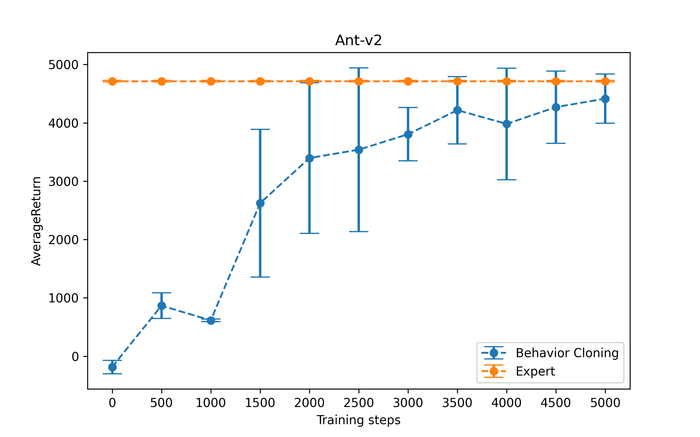

**Note**: install the cs285 package by
```pip install -e .```

# Q1 Behavior Cloning


## 1.2 Performance

Run `./run.sh 1.2` to generate the numbers for Section 1 Question 2. Check `run.sh` for more details.

|Environment|HalfCheetah|Ant|Hopper|Walker2d|Humanoid|
|:--:|:--:|:--:|:--:|:--:|:--:|
|Expert Mean|4205.78|4713.65|3772.67|5566.84|10344.52|
|BC Mean|2863.95|614.93|1093.88|107.39|279.93|
|Expert Std|83.04|12.20|1.95|9.23|20.98|
|BC Std|192.84|24.00|275.36|129.29|16.34|


## 1.3 Hyperparameter


This section explores the impact of hyperparameter: `num_agent_train_steps_per_iter`.

<!-- #region -->
Run `./run.sh 1.3` to generate the numbers for Section 1 Question 3. Check `run.sh` for more details.

This will run 10 experiments with 500 num_agent_train_stepsper_iter gap.

Copy the data of 10 experiments from `data` to `image/hyperparameters`, and then run `python image/plot.py` to get the following figure.

The following figure shows the effect of hyperparameter: `num_agent_train_steps_per_iter`.
<!-- #endregion -->


