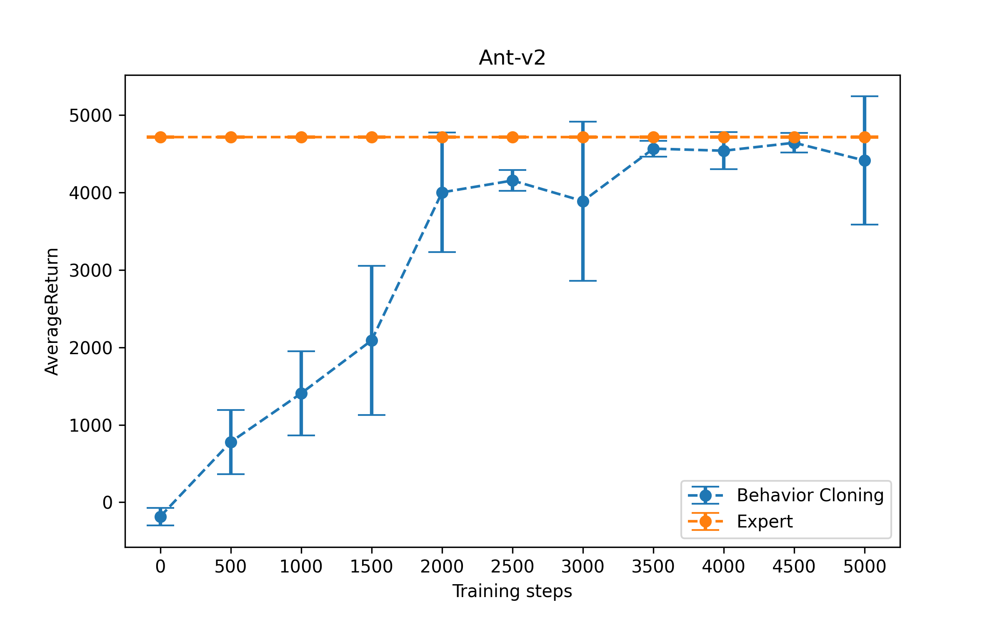

**Note**: install the cs285 package by
```pip install -e .```

# Section1 Behavior Cloning


## Question 1.2 Performance

Run `./run.sh 1.2` to generate the numbers for Section 1 Question 2. Check `run.sh` for more details.

The agent was trained on 1000 steps of expert behavior in each environment. It was then evaluated for 5000 steps to get an accurate mean performance. The agent itself had an MLP policy consisting of 2 hidden layers of 64 neurons each.

|Environment|HalfCheetah|Ant|Hopper|Walker2d|Humanoid|
|:--:|:--:|:--:|:--:|:--:|:--:|
|Expert Mean|4205.78|4713.65|3772.67|5566.84|10344.52|
|BC Mean|3141.98|1406.29|694.87|391.91|297.14|
|Expert Std|83.04|12.20|1.95|9.23|20.98|
|BC Std|125.42|544.66|309.72|480.56|22.40|


## Question 1.3 Hyperparameter


This section explores the impact of hyperparameter: `num_agent_train_steps_per_iter`.

<!-- #region -->
Run `./run.sh 1.3` to generate the numbers for Section 1 Question 3. Check `run.sh` for more details.

This will run 10 experiments with 500 num_agent_train_stepsper_iter gap.

Copy the data of 10 experiments from `data` to `image/hyperparameters`, and then run `python image/plot.py` to get the following figure.

The following figure shows the effect of hyperparameter: `num_agent_train_steps_per_iter`.
<!-- #endregion -->


