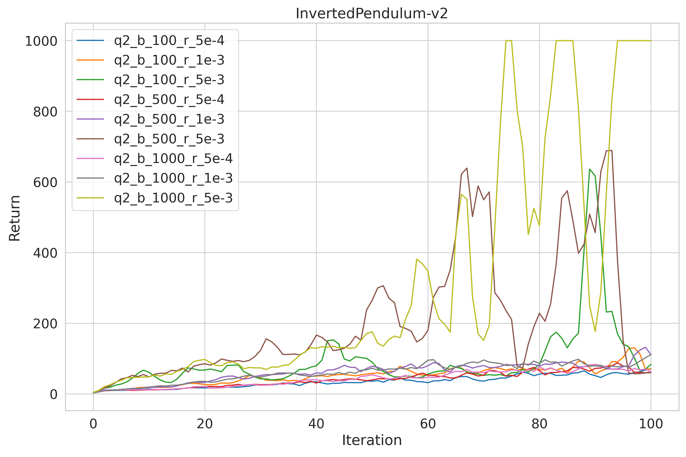
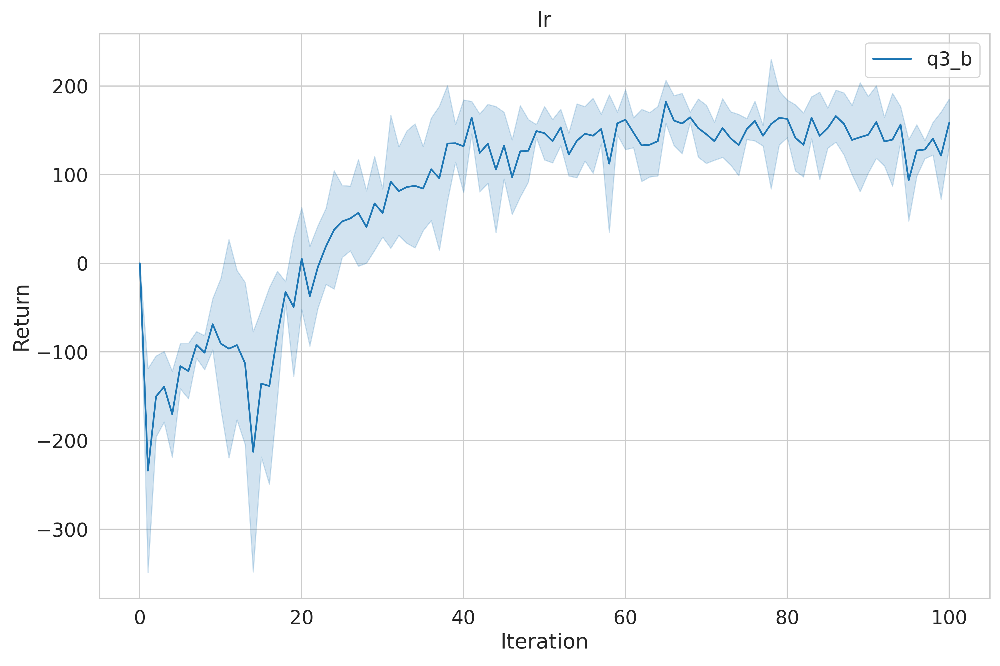
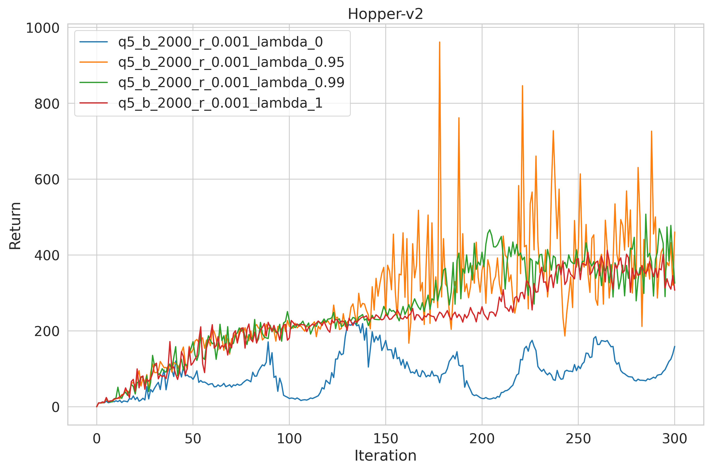
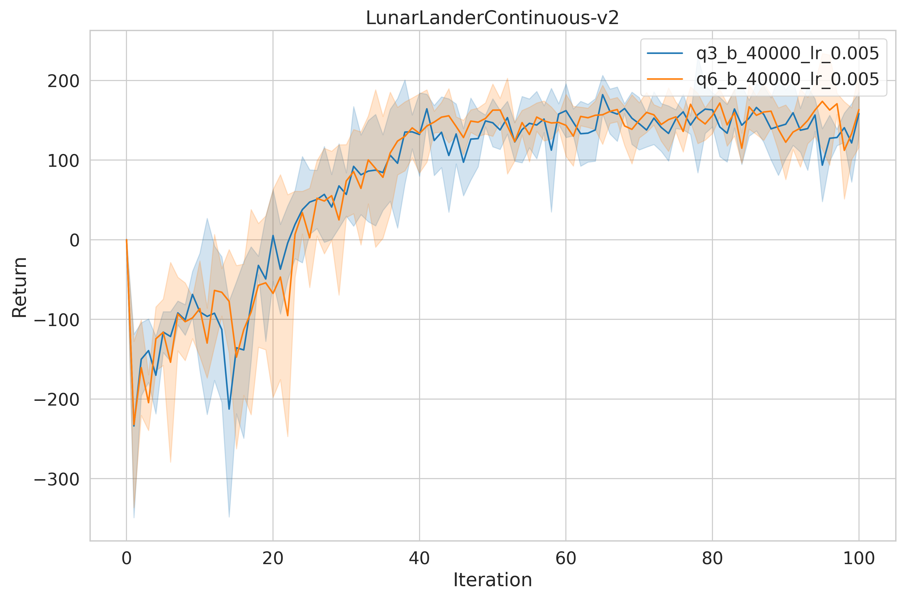

**Note**: Run `pip install -e .` to install cs285 package


# Section 2
## 1. Experiment 1 (CartPole)


### 1.1 q1 small batch

**<center>fig1: experiments of q1_sb </center>**

### 1.2 q1 large batch

**<center>fig2: experiments of q1_lb </center>**

<!-- #region -->
### 1.3 Q&A

- **Q: Which value estimator has better performance without advantage-standardization: the trajectorycentric one, or the one using reward-to-go?**


- **A: From `q1_sb_no-rtg_dsa` (the orange line) and `q1_sb_rtg_dsa` (the green line), we can see that the reward-to-go value estimator is better than the the trajectorycentric one.**


- **Q: Did advantage standardization help?**


- **A: Yes, as can be seen from fig.1, advantage standardization can reduce variance.**


- **Q: Did the batch size make an impact**


- **A: Larger batch size can speed up training and reduce variance.**
<!-- #endregion -->

<!-- #region -->
### 1.4 the exact command line configurations

- **Excute `./run.sh 2.1` to run q1 experiments.**


- **Excute `python cs285/scripts/read_results.py` to get fig1 and fig2 (figures will be saved in `image` folder)**
<!-- #endregion -->

## 2 Experiment 2 (InvertedPendulum)

### 2.1 hyper-parameter `batch_size` and `learning_rate`

<!-- #region -->
- **I did servaral experiments on `batch_size` in (100, 500, 1000) and  `learning_rate` in (5e-4 1e-3 5e-3). All experiments just for a single random seed. The learning curves is shown in the following fig3.**


- **From fig3 (yellow line), `batch_size=1000`, `learning_rate=5e-3` seem to be the best parameters I found.**

    - (Note: I do not conduct too many hyperparameter experiments because it's boring for me.)



**<center>fig3: experiments of q2 </center>**
<!-- #endregion -->

<!-- #region -->
### 2.2 the exact command line configurations

- **Excute `./run.sh 2.2` to run q2 experiments.**


- **Excute `python cs285/scripts/read_results.py` to get fig3 (the figure will be saved in `image` folder)**
<!-- #endregion -->

<!-- #region -->
## 3 Experiment 3 (LunarLander)

### 3.1 learning curve

- **The learning curve of LunarLander-v2 over 5 random seeds is shown in fig 4.**


- **Excute `./run.sh 2.3` to get results and `python cs285/scripts/read_results.py` to get fig4 (the figure will be saved in `image` folder)**
<!-- #endregion -->


**<center>fig4: experiments of q3 </center>**

<!-- #region -->
## 4 Experiment 4 (LunarLander)

### 4.1 learning curve

- **the learning curves for the HalfCheetah experiments is shown in fig5.**


- **Excute `./run.sh 2.4.1` to get results and `python cs285/scripts/read_results.py` to get fig5 (the figure will be saved in `image` folder)**


- **Fig5 shows that `batch_size=30000` and `lr=0.02` are optimal values `b*` and `r*` I found.(RL is magic)**


- **In general, for Halfcheetah-v2 task, higher learning rate corresponds to higher performance, while batch size has little impact on performance.**
<!-- #endregion -->


**<center>fig5: experiments of q4.1 </center>**

<!-- #region -->
### 4.2 learning curve

- **the learning curves for the HalfCheetah experiments is shown in fig6.**


- **Excute `./run.sh 2.4.2` to get results and `python cs285/scripts/read_results.py` to get fig6 (the figure will be saved in `image` folder)**
<!-- #endregion -->


**<center>fig6: experiments of q4.2 </center>**

<!-- #region -->
## Bonus-GAE

## Experiment 5 (Hopper-v2) 
**Note:** (this experiment copy from cs285 2021Fall homework)


- **the learning curves for the HalfCheetah experiments is shown in fig7.**


- **Excute `./run.sh 2.5` to get results and `python cs285/scripts/read_results.py` to get fig7 (the figure will be saved in `image` folder)**
<!-- #endregion -->


**<center>fig7: experiments of Bouns-GAE </center>**

<!-- #region -->
## Bonus-Multi threads
## Experiment 6 (LunarLander)
- **I compared the training time with experiment 3.**


- **With `gym.vector.Asyncvectorenv`, you can easily implement multiprocessing to sample trajectories.**


- **Excute `./run.sh 2.6` to get results and `python cs285/scripts/read_results.py` to get fig8 (the figure will be saved in `image` folder)**


- **The function to set parallel sampling is as follows. `num_envs` is used to specify the number of threads used.**


```python
def make_envs(env_id, num_envs, seed, start_idx=0):
    def make_env(rank):
        def fn():
            env = gym.make(env_id)
            env.seed(seed+rank)
            env.action_space.seed(seed+rank)
            return env
        return fn
    if num_envs == 1: return make_env(start_idx)
    return AsyncVectorEnv(env_fns=[make_env(start_idx+rank) for rank in range(num_envs)])
```

- **The training time of the five experiments is shown in the table below. After using 10 process parallel sampling, the training time is reduced by more than 5 times!**

||Single Thread <br> Train Time(s)|10 Threads <br> Train Time(s)|
|:--:|:--:|:--:|
|Run1|5309|976|
|Run2|5149|968|
|Run3|5309|985|
|Run4|5190|980|
|Run5|5295|984|
|Average|5250|978|
<!-- #endregion -->


**<center> fig8: experiment of Bonus-MultiThread </center>**

<!-- #region -->
## Bonus-MultiStep PG
## Experiment 7 (HalfCheetah)

- **I compared multi-step PG with the optimal parameters selected in Experiment 4.1. I taking multiple gradient descent steps from 1 to 4 with the same batch of data.**


- **There are many ways to do multi-step gradient descent. I constructed a simple loop.**


``` python
self.optimizer.zero_grad()
for _ in range(self.multi_step-1):
    loss.backward(retain_graph=True)
loss.backward()
self.optimizer.step()
```

- **I used 15 parallel environments for sample collection and conducted experiments on another PC, so the performance is slightly different from that in experiment 4.1.**


- Reinforcement learning is really a metaphysics!


- **Excute `./run.sh 2.7` to get results and `python cs285/scripts/read_results.py` to get fig9 (the figure will be saved in `image` folder)**


- The learning curve is smoothed for clarity.
<!-- #endregion -->


**<center> fig9: experiment of Bonus-MultiStepPG </center>**
