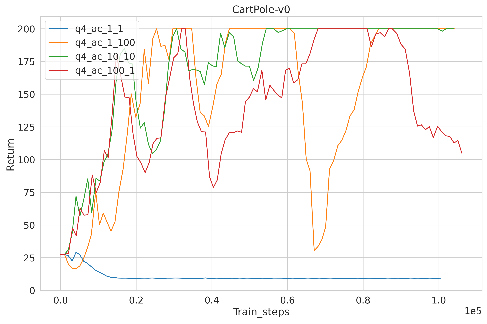

<!-- #region -->
**Note**: Run `pip install -e .` to install cs285 package

# Section 3
## 1. Question 1: basic Q-learning performance. (DQN)
<!-- #endregion -->

<!-- #region -->
- **Excute `./run.sh 3.0` to run experiments on LunarLander-v3.**

- **Excute `python cs285/scripts/read_results.py` to get the following figure(the figure will be saved in image folder)**
<!-- #endregion -->

<!-- #region -->
- **Excute `./run.sh 3.1` to run experiments on MsPacman-v0.**

- **Excute `python cs285/scripts/read_results.py` to get the following figure(the figure will be saved in image folder)**
<!-- #endregion -->

<!-- #region -->
## 2. Question 2: double Q-learning (DDQN)

- **Excute `./run.sh 3.2` to run experiments on LumarLander-v3 (5 runs).**

- **Excute `python cs285/scripts/read_results.py` to get the following figure(the figure will be saved in image folder).**
<!-- #endregion -->

<!-- #region -->
## 3. Question 3:  Experimenting with hyperparameters.

- **Excute `./run.sh 3.3` to run experiments on LumarLander-v3.**

- **Select `batch_size` from (16 32 64 128)**

- **Excute `python cs285/scripts/read_results.py` to get the following figure(the figure will be saved in image folder).**
<!-- #endregion -->

<!-- #region -->
## 4. Question 4:   Sanity check with Cartpole

- **Excute `./run.sh 3.4` to run experiments on Cartpole-v0.**

- **Excute `python cs285/scripts/read_results.py` to get the following figure(the figure will be saved in image folder).**

- **`num_target_updates=10` and `num_grad_steps_per_target_update=10` seems bettter.**
<!-- #endregion -->

<!-- #region -->
## 5. Question 5:   Sanity check with Cartpole

- **Run actor-critic with more difficult tasks. Use the best setting from the previous question to run InvertedPendulum and HalfCheetah.**

- **Excute `./run.sh 3.5` to run experiments on Cartpole-v0.**

- **Excute `python cs285/scripts/read_results.py` to get the following figure(the figure will be saved in image folder).**
<!-- #endregion -->

