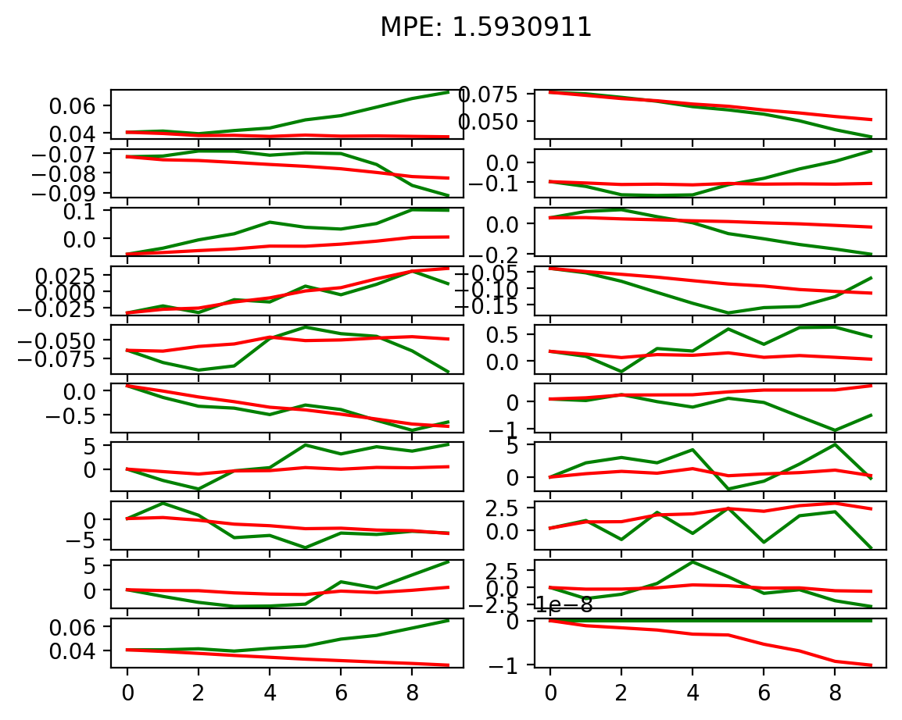
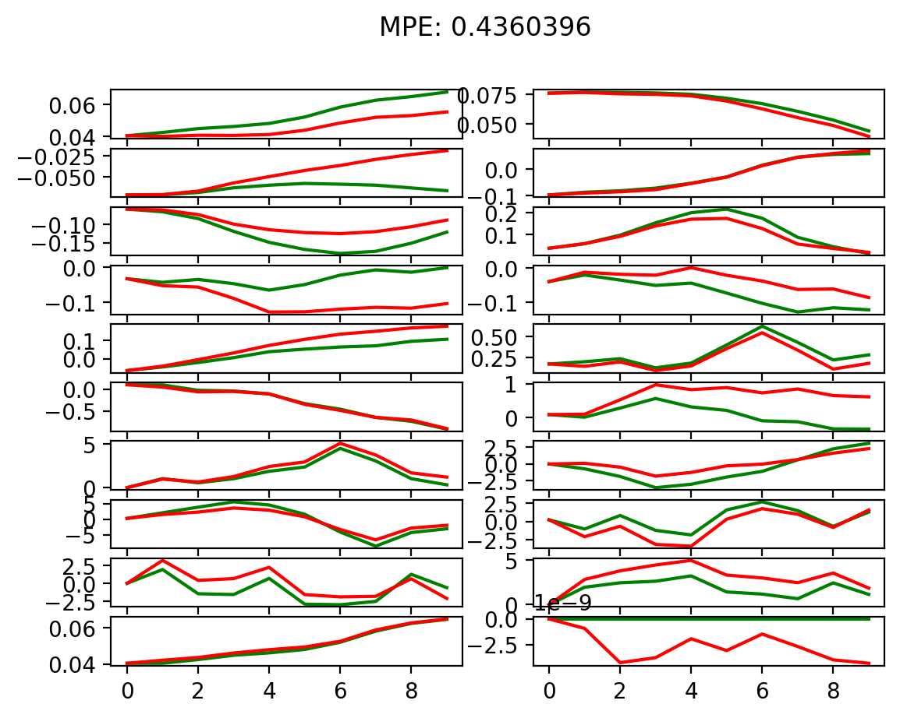
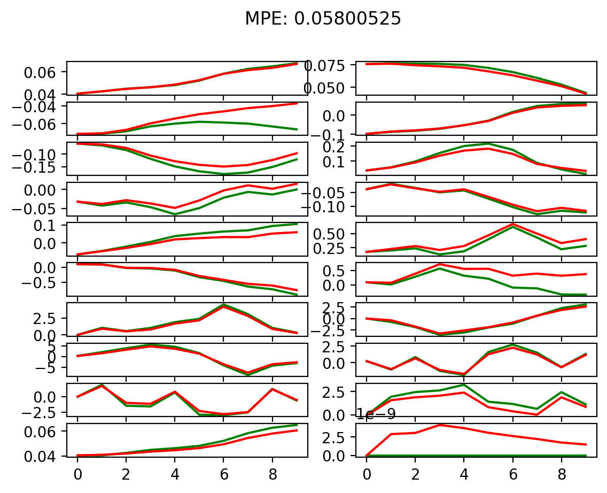
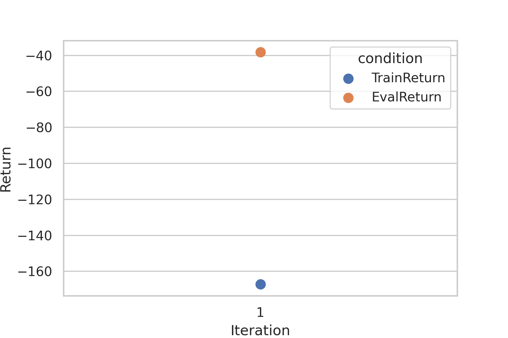
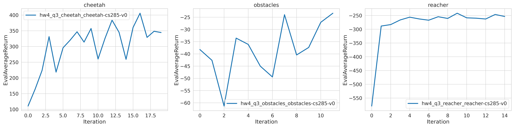
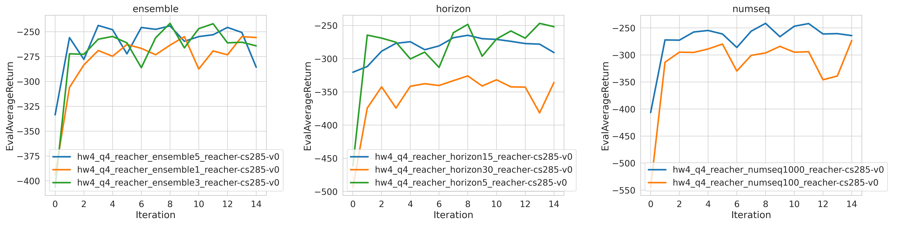
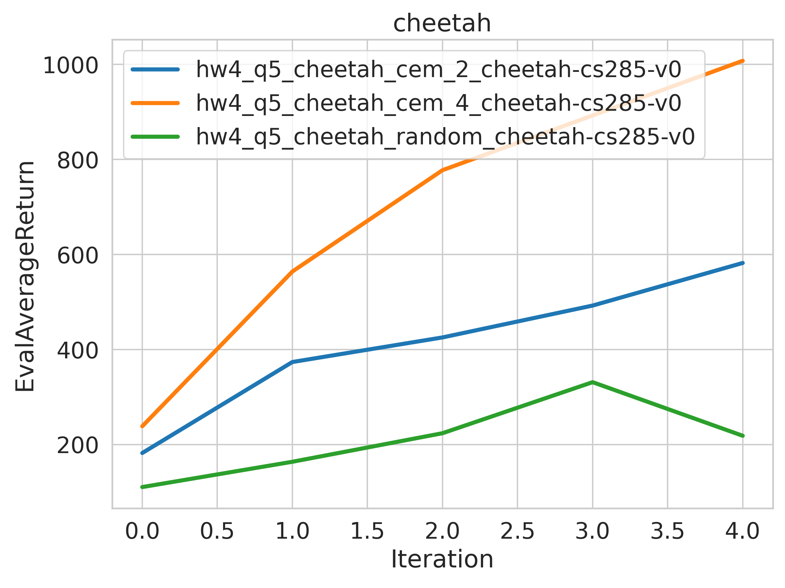

<!-- #region -->
**Note**: Run `pip install -e .` to install cs285 package

# Homework 4
## Problem 1: 
- **Run2: 5 iterations | 2 hidden layers | 250 nodes**

- **Run1: 500 iterations | 1 hidden layers | 32 nodes**

- **Run1: 500 iterations | 2 hidden layers | 250 nodes**

- **More complex architecture of neural network means stronger representation ability and lower MPE (model prediction error).**

- **More iterations means lower MRE**
<!-- #endregion -->

##  Problem 2: 

##  Problem 3:

##  Problem 4:

##  Problem 5:

