**Note**: Run `pip install -e .` to install cs285 package

# Homework5

## 1. Part1

### 1.1 Sub-Part1
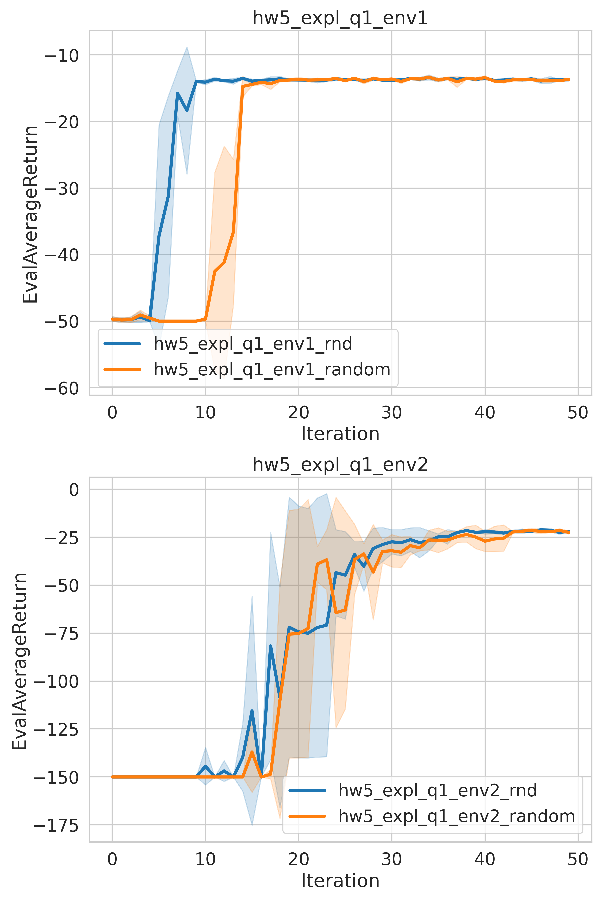

- In the easy environment, **RND** is better than **Random Exploration**. However, in the medium environment, **RND** has no significant advantage over **Random Exploration**.

#### [Rnd] State Density Heat Map in PointmassEasy-v0
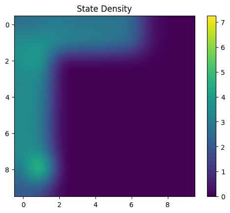

#### [Random] State Density Heat Map in PointmassEasy-v0
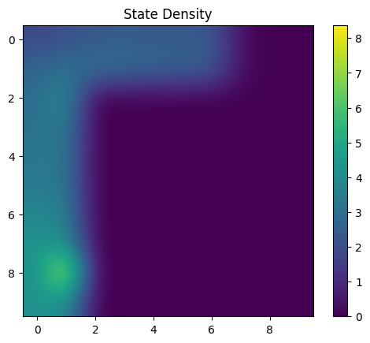

#### [RND] State Density Heat Map in PointmassMedium-v0
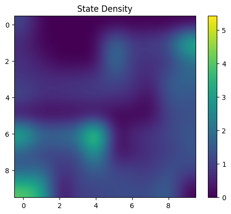

#### [ Random ] State Density Heat Map in PointmassMedium-v0
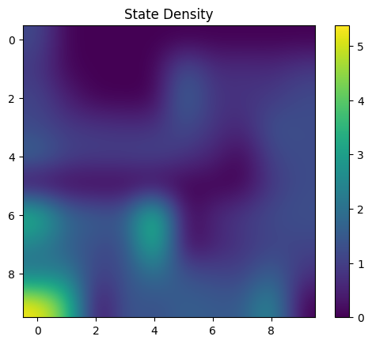

### 1.2 Sub-part2
For sub part2, I implements a dynamic model p(s,a) for exploration.

Dynamic model prediction the next observation s'= p(s,a).

The next state s' predicted by the dynamic model is measured whether state s is worth exploring

The dynamic model is trained to predict the state transition probability of environment.

For the frequently explored state transition, the dynamic model predicts the next state s' more accurately, and the value of exploration is small.

On the contrary, if a state transition is rarely explored, the prediction of the dynamic model is inaccurate and has great exploration value.

**The learning curve (through a smoothing window of 5) shows the comparison between RND and *our method (alg)* in medium and hard environments.**
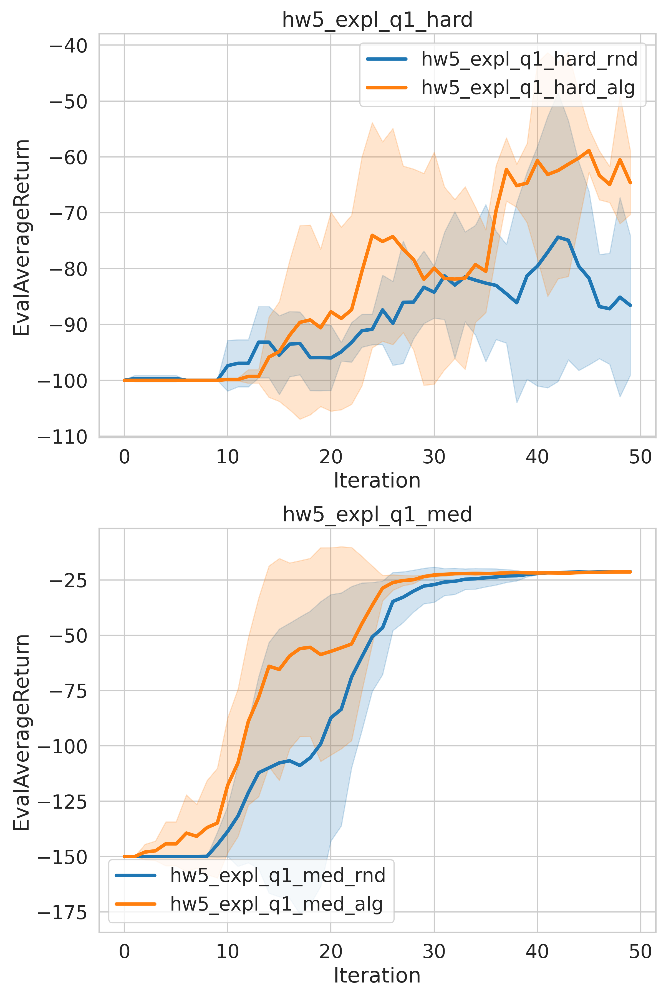

#### [ Dynamic Model ] State Density Heat Map in PointmassMedium-v0
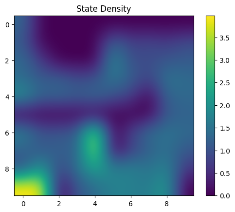

#### [ RND ] State Density Heat Map in PointmassMedium-v0
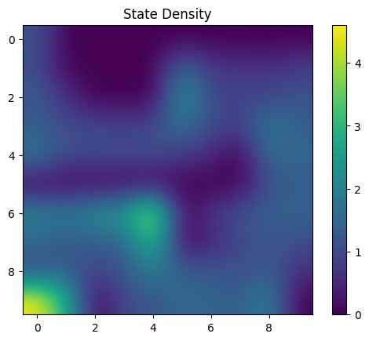

#### [ Dynamic Model ] State Density Heat Map in PointmassHard-v0
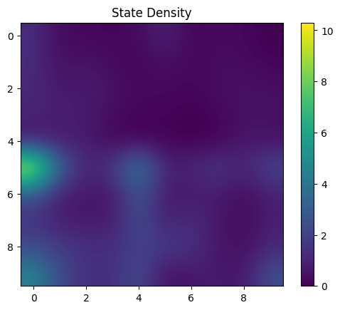

#### [ RND ] State Density Heat Map in PointmassHard-v0
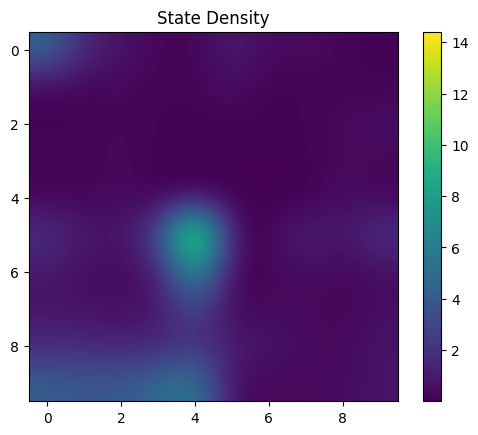

## 2. Part2
### 2.1 Sub-Part 1

- **Hint: The transformed reward function is r~(s,a) = (r(s,a)+ reward_shift) * reward_scale**

- **From the following figure, CQL can give rise to Q values that underestimate the Q-values learned via a standard DQN.**
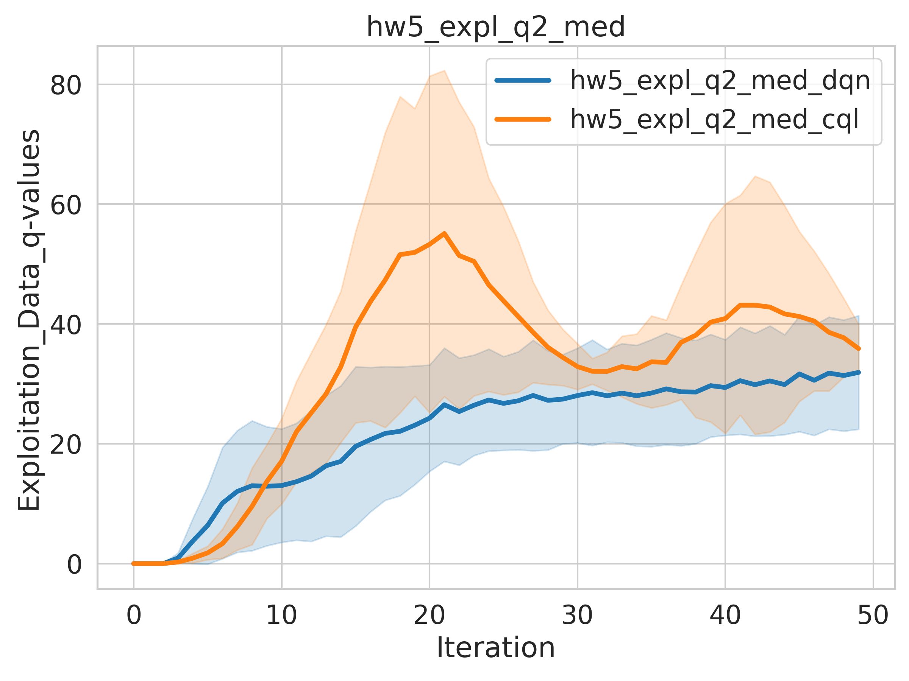

### 2.2 Sub-Part2
- **The following figure illustrates that more exploration steps can help stable the training process.**
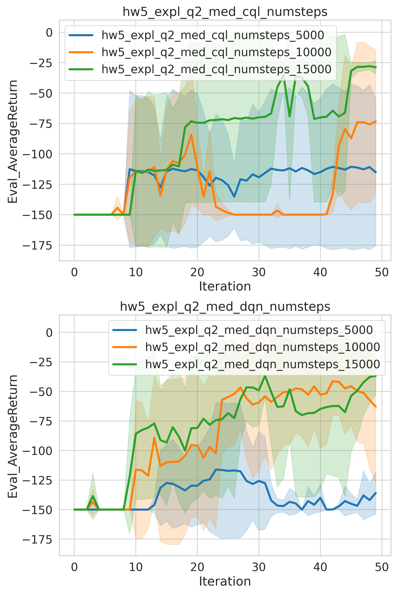

### 2.3 Sub-Part3
- **The following figure illustrates that alpha=0.1 seems to be a not beed choice.**
- **Note that the env rewards utilized by CQL are magnified by shift and scale, so the performance of CQL is slightly lower than that of dqn.**
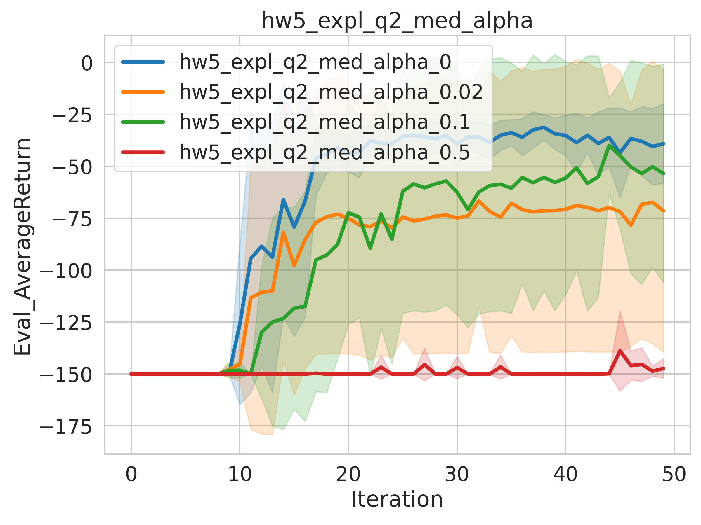

## 3. Part3
- **As can be seen from the figure below, DQN is significantly better than CQL (CQL rewards are scaled by shift and scale)**
- **I have no idea whether there is something wrong with my implementation, because I have not found that CQL is better than dqn in hard environments, as described in *hw5.pdf* .**
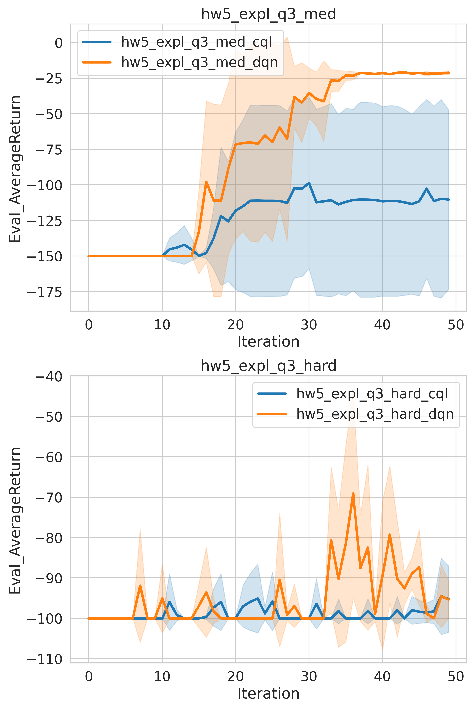

## 4. Part4
- **waiting to do.......**
